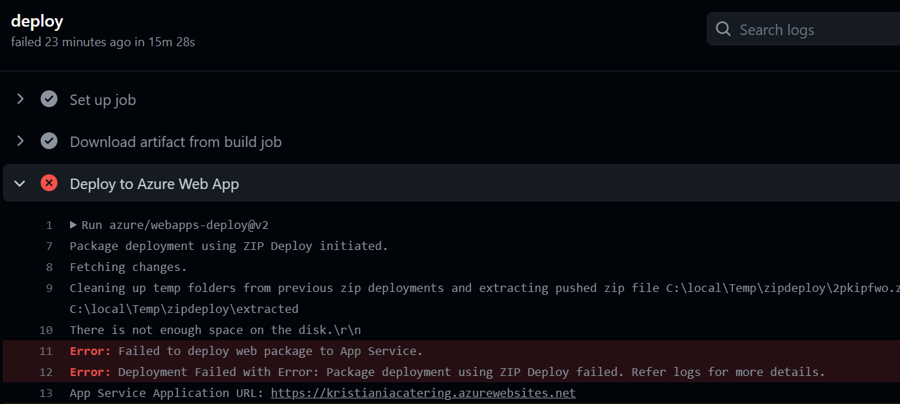

## PG6301 Exam 2022

Link to git repository: https://github.com/Mariusflores/pg6301-exam

 * CheckList
* [x] Some form of Login and access control
* [x] Jest tests
* [x] Snapshot tests
* [ ] Simulate + jest.fn
* [ ] Supertest
* [x] Github Actions with coverage report
* [x] Deployment to cloud (in this case, Azure)
* [x] Mongodb
* [x] Navigating in the application using React Router (remember Express Middleware)
* [x] Reading data from the server (remember error handling)
* [x] Writing data to the server
* [ ] Websockets

could not deploy to azure because disk was full

